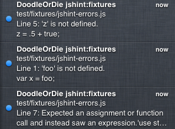

# grunt-notify

> Automatic desktop notifications for Grunt errors and warnings using Growl for OS X or Windows, Mountain Lion Notification Center, and Notify-Send.

[](https://github.com/dylang/grunt-notify)
[](https://github.com/dylang/grunt-notify)
[](https://github.com/dylang/grunt-notify)


## Getting Started

This plugin recommends Grunt `0.4.1` or newer.

## Installing

```bash
npm install grunt-notify --save-dev
```

Once that's done, add this line to your project's `Gruntfile.js`:

```js
// Automatic notifications when tasks fail.
grunt.loadNpmTasks('grunt-notify');
```

**That's all you need for automatic notifications.**

[](https://github.com/dylang/grunt-notify)

## Notify_Hooks Options

If you want change the automatic messaging configure a task called `notify_hooks`.

```js
grunt.initConfig({
 // This is completely optional.
  notify_hooks: {
    options: {
      enabled: true,
      title: "Project Name" // defaults to your project's directory name, you can change to the name of your project
    }
  }
});

// Load the task
grunt.loadNpmTasks('grunt-notify');

// This is required if you use any options.
grunt.task.run('notify_hooks');
```


## Showing Specfic Notifications

Sometimes you want to show messages like "Uglify complete" or "Project Deployed" - that's easy to do too.


```js
grunt.initConfig({
  notify: {
    task_name: {
      options: {
        // Task-specific options go here.
      }
    },
    watch: {
      options: {
        title: 'Task Complete',  // optional
        message: 'SASS and Uglify finished running', //required
      }
    },
    server: {
      options: {
        message: 'Server is ready!'
      }
    }
  }
});

grunt.loadNpmTasks('grunt-notify');

// simplified example
grunt.registerTask('server', ['uglify', 'sass', 'server', 'notify:server']);
```

[](https://github.com/dylang/grunt-notify)
[](https://github.com/dylang/grunt-notify)


### Options
* `title` (_optional_): Notification title
* `message` (_required_): Notification message

## Tests
Run `grunt` to lint and run the tests.

## Terminal Notifier
To use the native notification system OSX requires packages to be signed and compiled using their platform and tools.
This is not very friendly for Node users so we are using the tiny signed native application
[Terminal Notifer](https://github.com/alloy/terminal-notifier) from [Eloy Durán](https://github.com/alloy).
We're stuck with the default icon for now, if anybody knows how it would be nice if we could use the Grunt logo or something custom instead.

## Doodle or Die
This project was created for and is used by the free game I co-created for Node Knockout called [Doodle or Die](http://doodleOrDie.com). Please give it a try, we think you will enjoy it!


## Release History

* 31 Mar 2013 - 0.2.0
 * Complete rewrite.
 * New support for Grunt in Windows.
 * Now parses JSLint errors to show them in notification.
 * Notification title will automatically use package.json name field or directory name.
 * No more subtitle option.
 * Title now includes the task that was running.
 * Better command line escaping including support for newline (\n).
* 17 Mar 2013 - 0.1.6
 * Code refactor to clean things up
* 19 Feb 2013 - 0.1.4
 * Added Linux support thanks to @johnmccalla
 * listen for fatal errors
 * simplified options
 * default title is project title
 * show file name and line number if available
* 28 Dec 2013 - 0.1.0-0.1.3
 * First version

