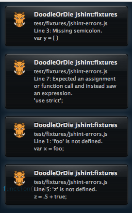

# grunt-notify

> Automatic desktop notifications for Grunt errors and warnings using Growl for OS X or Windows, Mountain Lion Notification Center, and Notify-Send.

[](https://github.com/dylang/grunt-notify)
[](https://github.com/dylang/grunt-notify)
[](https://github.com/dylang/grunt-notify)

## Getting Started

This plugin recommends Grunt `0.4.1` or newer.

## Installing

```bash
npm install grunt-notify --save-dev
```

Once that's done, add this line to your project's `Gruntfile.js`:

```js
// Automatic notifications when tasks fail.
grunt.loadNpmTasks('grunt-notify');
```

**That's all you need for automatic notifications.**

[](https://github.com/dylang/grunt-notify)
[](https://github.com/dylang/grunt-notify)


## Notify_Hooks Options

If you want change the automatic messaging configure a task called `notify_hooks`.

```js
grunt.initConfig({
 // This is optional!
  notify_hooks: {
    options: {
      enabled: true,
      max_jshint_notifications: 5, // maximum number of notifications from jshint output
      title: "Project Name" // defaults to the name in package.json, or uses project's directory name, you can change to the name of your project
    }
  }
});

// Load the task
grunt.loadNpmTasks('grunt-notify');

// This is required if you use any options.
grunt.task.run('notify_hooks');
```

## Showing Specfic Notifications

Sometimes you want to show messages like "Uglify complete" or "Project Deployed" - that's easy to do too.

[](https://github.com/dylang/grunt-notify)
[](https://github.com/dylang/grunt-notify)

```js
grunt.initConfig({
  notify: {
    task_name: {
      options: {
        // Task-specific options go here.
      }
    },
    watch: {
      options: {
        title: 'Task Complete',  // optional
        message: 'SASS and Uglify finished running', //required
      }
    },
    server: {
      options: {
        message: 'Server is ready!'
      }
    }
  }
});

grunt.loadNpmTasks('grunt-notify');

// simplified example
grunt.registerTask('server', [
  'uglify',
  'sass',
  'server',
  'notify:server'
  ]);
```

### Options
* `title` (_optional_): Notification title
* `message` (_required_): Notification message

## Tests
Run `grunt` to lint and run the tests.

## Terminal Notifier
Apple does not provide an API to the OS X Notification Center that Node can access. Only code written in Objective C and signed in XCode can use it.
This is not very friendly for Node users so we are using the tiny signed MIT-licensed native application
[Terminal Notifer](https://github.com/alloy/terminal-notifier) from [Eloy Durán](https://github.com/alloy).
I've changed the default icon which is owned by Apple to the Grunt logo.

## Doodle or Die
This project was created for and is used by the free game I co-created for Node Knockout called [Doodle or Die](http://doodleOrDie.com). Please give it a try, we think you will enjoy it!

## Release History
* 30 May 2013 - 0.2.4
 * Make notications more reliable. They should show up now even if Grunt exists from an error.
 * Fix problems with `\n` in a windows path becoming a new line, like `c:\new`.
 * Don't show too many jshint errors. By default only 5 jshint notifications, and that number is configurable.
* 4 Apr 2013 - 0.2.3
 * Avoid problems when there's no stack trace on errors thanks to [@joeybaker](https://github.com/joeybaker).
* 1 Apr 2013 - 0.2.2
 * Fix bug in Notify-Send thanks to [@jcoffin](https://github.com/jcoffin).
* 1 Apr 2013 - 0.2.1
 * Fix dependencies.
* 31 Mar 2013 - 0.2.0
 * Complete rewrite.
 * New support for Grunt in Windows.
 * Now parses JSLint errors to show them in notification.
 * Notification title will automatically use package.json name field or directory name.
 * No more subtitle option.
 * Title now includes the task that was running.
 * Better command line escaping including support for newline `\n`.
* 17 Mar 2013 - 0.1.6
 * Code refactor to clean things up
* 19 Feb 2013 - 0.1.4
 * Added Linux support thanks to [@johnmccalla](https://github.com/johnmccalla).
 * Listen for fatal errors.
 * Simplified options.
 * Default title is project title.
 * Show file name and line number if available.
* 28 Dec 2012 - 0.1.0-0.1.3
 * First version
